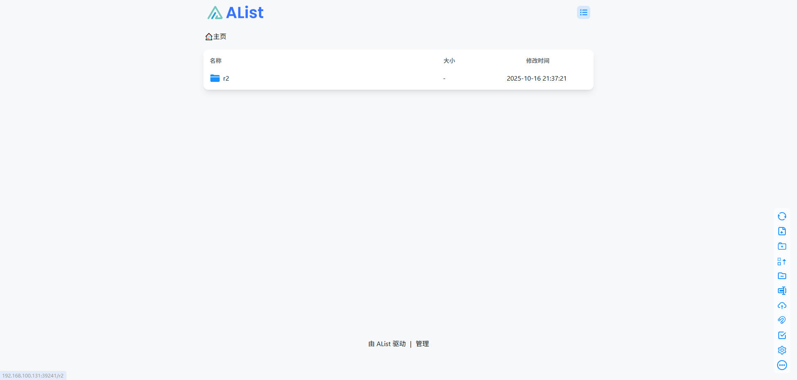
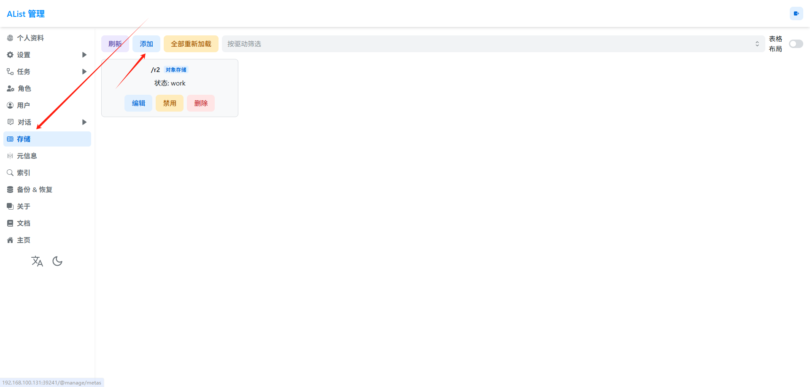
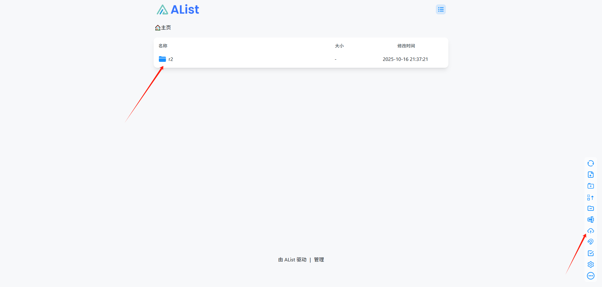
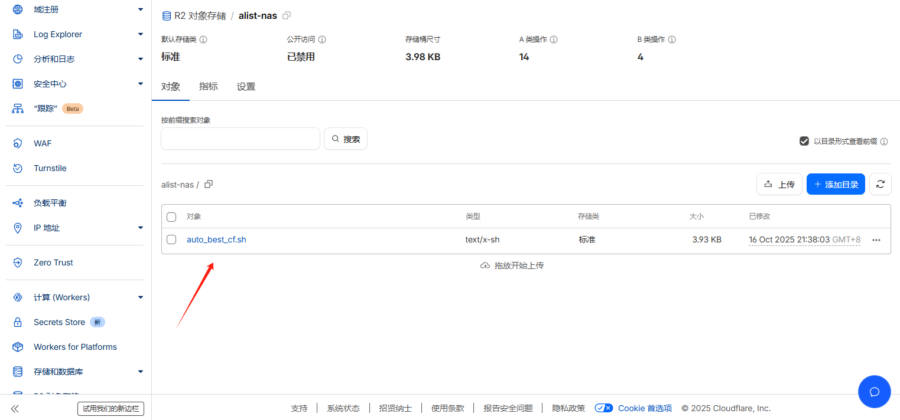

---
tags:
  - 对象存储
  - Alist
  - CloudflareR2
published: 2025-10-17
description: 介绍将CloudflareR2存储桶挂载到Alist中进行读写
title: 将CloudflareR2存储桶挂载到Alist
draft: false
image: ./index.png
category: Cloudflare
---
# 将CloudflareR2存储桶挂载到Alist进行读写

## 1：打开Cloudflare面板创建R2存储桶

打开[Cloudflare面板](https://dash.cloudflare.com)，左侧栏向下滚动，找到R2对象存储并点击创建


名称随便设置，位置建议选择距离物理位置较近的区域提升速度

## 2：获取管理指定存储桶的API令牌

点击图一右上角管理API令牌并创建AccountAPI令牌


按照图示，名称随便填，权限选择对象读和写，指定需要管理的存储桶，其余保持不变


创建后会出现几项值，请妥善保存，将不会再展示

## 3：安装Alist

打开[Alist文档安装页](https://alistgo.com/zh/guide/install/)查看适合你的安装方法，本文介绍使用Docker安装到本地Linux主机或家用NAS上


使用docker-compose.yml：
```yaml 
version: '3.3'
services:
  alist:
    image: 'alist666/alist:beta'
    container_name: alist
    volumes:
      - '/etc/alist:/opt/alist/data'
    ports:
      - '5244:5244'
    environment:
      - PUID=0
      - PGID=0
      - UMASK=022
    restart: unless-stopped 
```

使用Docker-Cli：
```bash 
docker run -d --restart=unless-stopped -v /etc/alist:/opt/alist/data -p 5244:5244 -e PUID=0 -e PGID=0 -e UMASK=022 --name="alist" alist666/alist:latest
```

成功运行容器后打开IP加端口5244，默认用户名admin，默认密码alist



点击下方的管理，建议先修改默认用户名和密码，再在左侧找到存储，点击添加




按照下方表格填写对应数据，其余不修改：


| 空缺       | 数据                   |
| -------- | -------------------- |
| 驱动       | 对象存储                 |
| 挂载路径     | /xxx（示例）             |
| 根文件夹路径   | /                    |
| 存储桶      | 你的存储桶名称              |
| Endpoint | 为 S3 客户端使用管辖权地特定的终结点 |
| 地区       | auto                 |
| 访问密钥 Id  | 访问密钥 ID              |
| 安全访问密钥   | 机密访问密钥               |
点击添加，回到主页，选择目录，尝试上传并在Cloudflare面板查看是否上传成功





# 到此结束

