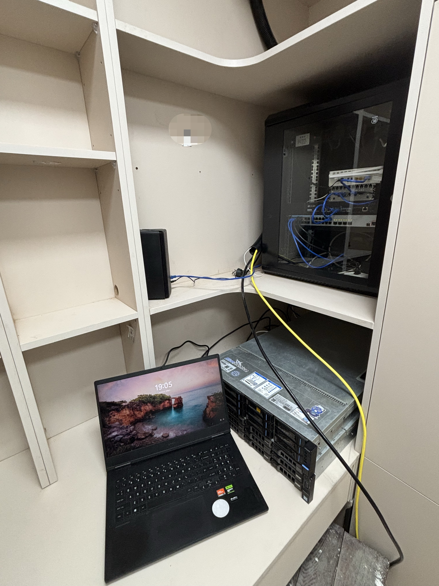

---
tags:
  - Homelab
  - 代理
  - Openwrt
  - ProxmoxVE
  - ESXi
  - NAS
published: 2025-12-30
image: ./index.jpg
description: 记录并介绍我的 Homelab 软硬件架构，包括 OpenWrt、Proxmox VE、ESXi、NAS 与代理相关配置，作为持续更新的家庭实验室实践笔记。
title: 我的 Homelab 架构记录：OpenWrt / Proxmox VE / ESXi / NAS
draft: false
category: Homelab
---

今天是2025年最后一天，实在想不出来写什么，以前写的差到我接受不了（） 我打算水一篇：介绍我的Homelab硬件及软件服务

# 设备列表

## 机架式服务器

- 戴尔 PowerEdge R730xd
- 浪潮英信 SA5212M4

## 网络设备

- 倍控四网口2.5G J4125
- 华为 S5700S-28P-LI-AC 24电4光千兆交换机
- 希力威视 SR-ST3408F 4电4光万兆交换机
- 小米 AX3000 WiFi6 无线路由器
- 华为 BE3 Pro WiFi7 无线路由器

## 存储服务器

- 绿联 DXP4800

# 硬件配置

## PowerEdge R730xd

CPU：双路Intel Xeon CPU E5-2680 v4

RAM：Hynix DDR4 2133 16GB x4 共64GB

RAID Card：PERC H730 Mini (嵌入式)

Network：Intel 82599 10 Gigabit Dual Port Network Connection、Intel(R) 2P 
X540/2P I350 rNDC

Power：Dell PowerEdge 750W PSU x2

## SA5212M4

CPU：双路Intel Xeon CPU E5-2680 v4

RAM：Hynix DDR4 2133MHz 16GB x4 共64GB

Network：Intel I350 Gigabit Network Connection x2

## DXP4800

RAM：Samsung M425R1GB4BB0-CQKOL 8GB 4800MHz

Disk：WesternDigital WDC WD40EFPX-68C6CNO 4TB x4

# 软件服务

## DXP4800

### Docker容器

- [miiot/micam](https://github.com/miiot/micam)获得小米摄像头rtsp流
- [amtoaer/bili-sync](https://github.com/amtoaer/bili-sync)爬取bilibili收藏夹内视频和弹幕等数据
- [PBH-BTN/PeerBanHelper](https://github.com/PBH-BTN/PeerBanHelper)自动封禁异常或吸血的BT客户端，搭配qBittorrent软件使用
- [qBittorrent](https://www.qbittorrent.org/)BT客户端，搭配PeerBanHelper使用
- [iventoy](https://www.iventoy.com/)PXE服务器
- [dani-garcia/vaultwarden](https://github.com/dani-garcia/vaultwarden)Bitwarden的替代服务器，支持Bitwarden官方客户端
- [teamspeak3](https://github.com/TeamSpeak-Systems/teamspeak-linux-docker-images)更隐私的TS3服务器（仅内网），其他人使用Tailscale远程
- [Umami](https://github.com/umami-software/umami)网站统计，通过cloudflared穿透
- [louislam/uptime-kuma](https://github.com/louislam/uptime-kuma)服务监控，通过cloudflared穿透

### 宿主机服务

[Tailscale](https://github.com/tailscale/tailscale)服务端：开启尾网和出口节点，搭配软路由静态路由表，自建DERP服务器，实现远程访问内网和使用家庭网络出口代理等功能

## J4125 Openwrt主路由

### Docker容器

- [MetaCubeX/subconverter](https://github.com/MetaCubeX/subconverter)订阅转换后端，仅内网
- [CareyWang/sub-web](https://github.com/CareyWang/sub-web)订阅转换前端
- [sub-store-org/Sub-Store](https://github.com/sub-store-org/Sub-Store)订阅管理器

### luci-app

- [Openwrt-Passwall/openwrt-passwall2](https://github.com/Openwrt-Passwall/openwrt-passwall2)：搭建远程访问内网的VLESS节点
- [gdy666/lucky](https://github.com/gdy666/lucky)：解析IPv6地址到域名，搭配VLESS节点远程访问内网，签发SSL/TLS证书玩点其他协议（？
- [vernesong/OpenClash](https://github.com/vernesong/OpenClash)：规则分流和Fake-IP实现内网全流量代理
- WireGuard 状态：显示WireGuard客户端状态，服务端搭配DDNS实现WireGuard访问内网
- KMS Server：自动激活内网Windows设备和Windows Office

## SA5212M4

安装ProxmoxVE，运行系统：

- Alpine-virt-3.23
- BackTrack-5-R3
- Ubuntu-6.06-LTS
- Ubuntu-10.04-LTS
## R730xd ESXi

### Debian

Debian虚拟机从OpenClash排除代理，运行：

- [cmliu/CFnat-Docker](https://github.com/cmliu/CFnat-Docker)优选CloudflareIP并转发指定CDN端口到本地
- [XIU2/CloudflareSpeedTest](https://github.com/XIU2/CloudflareSpeedTest)优选CloudflareIP并搭配shell脚本写入域名
- [AlistGo/alist](https://github.com/AlistGo/alist)挂载本地磁盘WebDAV服务
- [gdy666/lucky](https://github.com/gdy666/lucky)网络服务工具，支持DDNS、STUN、SSL管理、Web服务等功能
- [cloudflare/cloudflared](https://github.com/cloudflare/cloudflared)运行在lucky中的cloudflaretunnel服务
- [ipfs/ipfs-webui](https://github.com/ipfs/ipfs-webui)基于[ipfs/kubo](https://github.com/ipfs/kubo)的IPFS节点管理面板
- [actions/runner](https://github.com/actions/runner)Github自托管Actions Runner
- [cmliu/subconverter](https://github.com/cmliu/subconverter)支持WebSocket传输层的订阅转换后端，通过cloudflared映射到域名
- [go-gitea/gitea](https://github.com/go-gitea/gitea)自托管Git服务，通过cloudflared穿透

### Ubuntu

主要算力机，运行：
- [MCSManager](https://github.com/MCSManager/MCSManager)搭建从客户端迁移存档的Minecraft1.21.10-Fabric0.17.3服务器

### WindowsServer

- [Splamy/TS3AudioBot](https://github.com/Splamy/TS3AudioBot)TeamSpeak3机器人，播放音乐和Youtube视频
- torrc：向内网开放Tor代理的Socks5服务

# 网络环境

运营商是中国移动，千兆下行百兆上行，光猫桥接，CGNAT双向NAT1，IPv6 /60前缀

# 最后祝大家元旦快乐x
